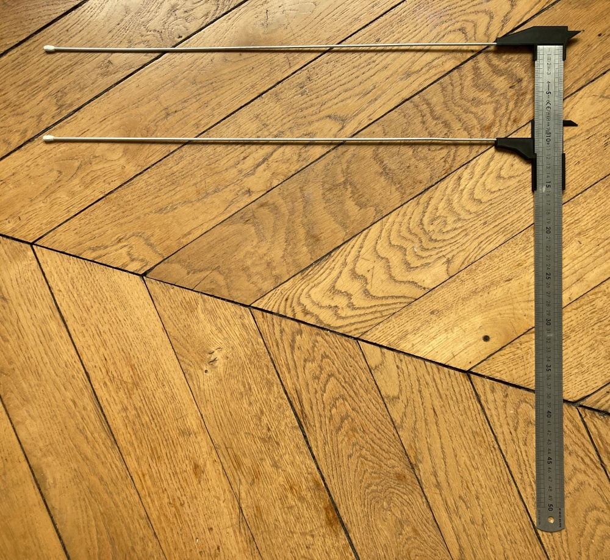

# Extra-Large and Light Ruler-based Calipers

Calipers made with flat metal rules are great, but what happens if you want
measure something that's more than a couple of centimeters in depth, such as
vases, pots and bottles. Well, you extend the heck out of it!

Print one of each model, using supports for the extending rods' holes. Stick
a 3mm rod of aluminium in each of the holes, and add a little Sugru at the
end of the rods to avoid scratches from the bare metal.

## STL models

The STL models are available on [Printables.com](https://www.printables.com/model/220544-extra-large-and-light-ruler-based-calipers).

## License

This is a re-re-remixed thing from, [Calipers attachment for a ruler, Snap fit remix](https://www.printables.com/model/160237-calipers-attachment-for-a-ruler-snap-fit-remix)
by [Kuni](https://www.printables.com/social/241022-kuni), that remixed [Caliper add-on for Westcott Stainless Steel Ruler](https://www.thingiverse.com/thing:202595)
by [EyeOfOdin](https://www.thingiverse.com/EyeOfOdin), that remixed [Calipers, attachment for a ruler](https://www.thingiverse.com/thing:161702)
by [danielsoltis](https://www.thingiverse.com/danielsoltis).

Licensed under [CC BY SA 4.0](https://creativecommons.org/licenses/by-sa/4.0/).
